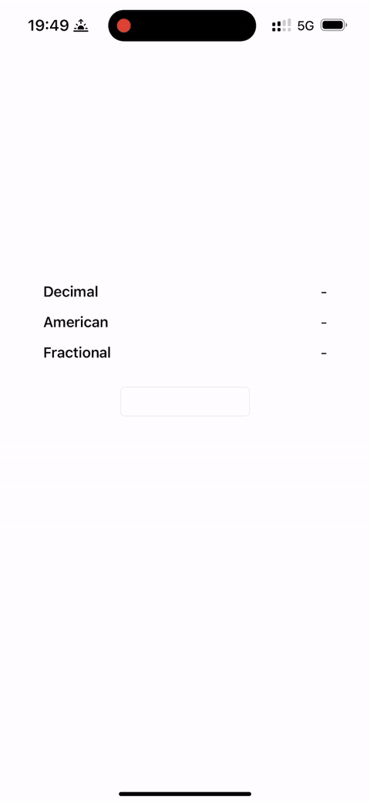

# OddsConverter

[](https://cocoapods.org/pods/OddsConverter)
[](https://cocoapods.org/pods/OddsConverter)
[](https://travis-ci.org/Jorge-Palomino/OddsConverter)
[](https://cocoapods.org/pods/OddsConverter)





## Introduction

OddsConverter is a class made to convert odds between american, decimal, and fractional formats.

Inspired by [OddsConverter PHP](https://github.com/sharapov-outsource/odds-converter).

## Example

To run the example project, clone the repo, and run `pod install` from the Example directory first.

## Requirements

- iOS 10.0+
- XCode 10.0 +
- Swift 4.0+

## Installation

OddsConverter is available through [CocoaPods](https://cocoapods.org). To install
it, simply add the following line to your Podfile:

```ruby
pod 'OddsConverter'
```

## Usage

```swift
import OddsConverter
```

Once imported, you can open a create a new odd from a String:

```swift
let odd = OddsConverter(odd: "275")
```

or from a number:

```swift
let odd = OddsConverter(odd: 275)
```
and we will automatically detect the odd type and convert it to all three: american, decimal and fractional.

```swift
if let dec = odd.getDecimal() {
    print(dec) // 3.75
}
if let fra = odd.getFractional() {
    print(fra) // 69/25
}
if let ame = odd.getMoneyline() {
    print(ame) // 275
}
```

## License

OddsConverter is available under the MIT license. See the LICENSE file for more info.

## Author

Jorge Palomino, imvisno@gmail.com

## License

StompClientLib is available under the MIT license. See the LICENSE file for more info.

⌨️ with ♡ by [J. Palomino](https://github.com/Jorge-Palomino) 😈
